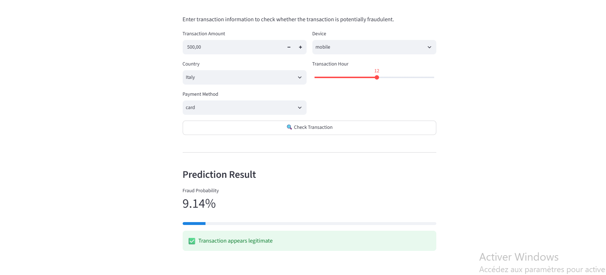
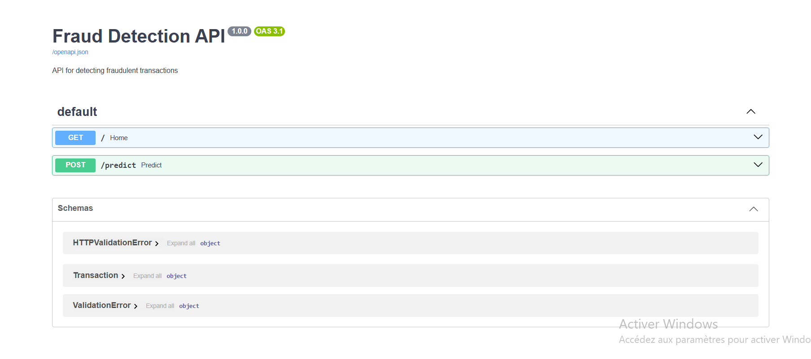

# 🛡️ Fraud Detection Platform

An end-to-end Machine Learning platform for detecting potentially fraudulent transactions.

## 📌 Project Overview

This project uses Machine Learning to classify financial transactions as:

- Fraud
- Not Fraud

The platform includes data preprocessing, model training, model evaluation, a FastAPI prediction API, a Streamlit dashboard, and Docker deployment.

## 🏗️ Architecture

```text
Transaction
     ↓
Preprocessing
     ↓
XGBoost Model
     ↓
Fraud Probability
     ↓
FastAPI
     ↓
Streamlit Dashboard
```

## 📸 Screenshots

### Streamlit Dashboard



### FastAPI Documentation



## 🤖 Machine Learning Models

Three classification models were evaluated:

- Logistic Regression
- Random Forest
- XGBoost

### Model Results

| Model | Precision | Recall | F1 Score | ROC-AUC |
|---|---:|---:|---:|---:|
| Logistic Regression | 0.01498 | 0.64777 | 0.02928 | 0.68440 |
| Random Forest | 0.01639 | 0.02405 | 0.01949 | 0.56143 |
| XGBoost | 0.01678 | 0.67698 | 0.03275 | 0.71976 |

**XGBoost achieved the best ROC-AUC score (0.71976) among the evaluated models.**

## 🚀 Features

- Fraud probability prediction
- XGBoost classification
- Class imbalance handling
- Precision, Recall, F1 and ROC-AUC evaluation
- FastAPI REST API
- Streamlit interactive dashboard
- Docker deployment

## 🛠️ Technologies

- Python
- Pandas
- NumPy
- Scikit-learn
- XGBoost
- FastAPI
- Streamlit
- Docker
- Joblib

## 📂 Project Structure

```text
fraud-detection-platform/
│
├── dashboard/
│   └── app.py
│
├── data/
│   └── raw/
│
├── models/
│   ├── xgboost_fraud_model.pkl
│   └── preprocessor.pkl
│
├── notebooks/
│   └── 01_eda.ipynb
│
├── screenshots/
│   ├── dashboard.png
│   └── api-docs.png
│
├── src/
│   ├── generate_data.py
│   ├── preprocess.py
│   ├── train_model.py
│   └── api.py
│
├── Dockerfile
├── .dockerignore
├── .gitignore
├── requirements.txt
└── README.md
```

## ▶️ How to Run the Project

### 1. Install Dependencies

```bash
pip install -r requirements.txt
```

### 2. Run the FastAPI API

```bash
uvicorn src.api:app --reload
```

The API will be available at:

```text
http://127.0.0.1:8000
```

Swagger documentation:

```text
http://127.0.0.1:8000/docs
```

### 3. Run the Streamlit Dashboard

```bash
streamlit run dashboard/app.py
```

### 4. Run with Docker

Build the Docker image:

```bash
docker build -t fraud-detection-platform .
```

Run the container:

```bash
docker run -p 8000:8000 fraud-detection-platform
```

## 🧪 Example Prediction

Example transaction:

```json
{
  "amount": 500,
  "country": "Italy",
  "payment_method": "card",
  "device": "desktop",
  "hour": 12
}
```

Example response:

```json
{
  "prediction": "Not Fraud",
  "fraud_probability": 0.0849
}
```

## 📊 Model Evaluation

The models were evaluated using:

- Precision
- Recall
- F1 Score
- ROC-AUC

Because fraud detection is an imbalanced classification problem, recall and ROC-AUC were considered important evaluation metrics.

## 🐳 Docker Deployment

The application is containerized using Docker to provide a consistent and reproducible deployment environment.

## 📌 Conclusion

This project demonstrates an end-to-end fraud detection workflow, from data preprocessing and model evaluation to API integration, interactive visualization, and containerized deployment.